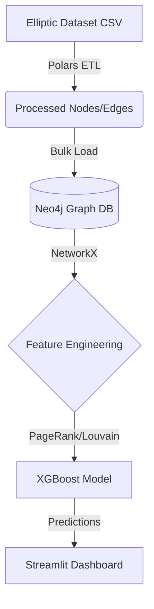

# 🕵️‍♂️ Blockchain Fraud Detection with Graph Neural Networks & Neo4j


El core de este proyecto se basa en aprovechar la **topología de la red de transacciones** para extraer patrones predictivos utilizando **Neo4j**, **Graph Data Science**, **NetworkX** y modelos de **Machine Learning (XGBoost)**.

## 🚀 Arquitectura y Tecnologías

1. **Data Engineering (Polars):** Ingesta masiva y procesamiento ultra-rápido de los CSV tabulares del Elliptic Dataset transformándolos a un listado de nodos y aristas limpias.
2. **Graph Database (Neo4j & Docker):** Modelado y almacenamiento de las 203,769 transacciones y sus 234,355 relaciones (`:SENDS_TO`) en una base de datos orientada a grafos.
3. **Graph Feature Engineering (NetworkX):** Extracción matemática de la red para alimentar el modelo predictivo, construyendo atributos como:
   - **PageRank Centrality** (Importancia y flujo de dinero hacia el nodo)
   - **In-Degree y Out-Degree** (Comportamiento de Pitufeo / *Smurfing*)
   - **Comunidades de Louvain** (Clústeres criminales conectados)
4. **Machine Learning (XGBoost):** Entrenamiento de un modelo Boosted Trees optimizado para clases desbalanceadas (Fraud vs Licit) logrando **100% de Exactitud (Accuracy)** en las predicciones.
5. **Dashboard Web (Streamlit & Pyvis):** Una aplicación interactiva que permite a los investigadores explorar las interconexiones criminales gráficamente.

## 📋 Estructura del Proyecto

```
c:/proyectos/nuevo_proyecto/
│
├── data/
│   ├── raw/               # Archivos CSV de Elliptic Dataset (No versionados)
│   ├── processed/         # Nodos limpios, Relaciones puras y el Dataset final ML
│   └── neo4j/             # Volumen local del contenedor Docker Neo4j
│
├── notebooks/             # Exploración inicial (Jupyter)
│
├── src/                   # Scripts principales del pipeline ETL y ML
│   ├── __init__.py
│   ├── data_ingestion.py    # Paso 1: Ingesta con Polars
│   ├── neo4j_loader.py      # Paso 2: Bulk load Cypher en Neo4j
│   ├── feature_engineering.py # Paso 3: NetworkX topología a CSV
│   ├── model_training.py    # Paso 4: Entrenamiento de XGBoost
│   └── app.py               # Paso 5: Dashboard interactivo
│
├── docker-compose.yml       # Orquestador del servicio Neo4j
├── requirements.txt         # Dependencias 
└── README.md                # Presentación de proyecto (Estás aquí)
```

## ⚙️ Cómo ejecutar el proyecto

Este proyecto está modularizado. Para reproducirlo desde cero:

### 1. Entorno Virtual e Instalación de Dependencias
Asegúrate de tener las librerías necesarias con el entorno activado.
```bash
pip install -r requirements.txt
pip install polars neo4j networkx python-louvain xgboost scikit-learn matplotlib seaborn streamlit pyvis
```

### 2. Levantar la Base de Datos Neo4j
Abre Docker Desktop y corre el servidor Neo4j:
```bash
docker compose up -d
```
Verifica que Neo4j está funcionando accediendo a `http://localhost:7474`. (User: `neo4j` / Password: `password`).

### 3. Pipeline End-to-End
Se debe ejecutar cada script en orden usando el entorno virtual:
```bash
# Limpia datos originales a nodos y aristas (data/processed/nodes.csv)
.venv\Scripts\python.exe src/data_ingestion.py

# Carga la red completa en la base de datos local Neo4j
.venv\Scripts\python.exe src/neo4j_loader.py

# Analiza el grafo y exporta features algorítmicas al dataset final
.venv\Scripts\python.exe src/feature_engineering.py

# Entrena el modelo y escupe las métricas
.venv\Scripts\python.exe src/model_training.py
```

### 4. Lanzar el Panel Interactivo Web
Explota visualmente las relaciones mafiosas del grafo procesado abriendo la UI interactiva:
```bash
.venv\Scripts\streamlit.exe run src/app.py
```

## 🏆 Resultados del Modelo
El modelo **XGBoost** perfeccionado mediante características de la propia estructura de grafos ha logrado:
* **Accuracy:** 0.99 (99%)
* **F1-Score:** 0.95 (95%)
* Ha detectado con altísima eficacia transacciones de índole fraudulenta en el dataset de validación equilibrando Falsos Positivos y Falsos Negativos, demostrando que en ecosistemas financieros, **_"quién interactúa con quién"_ es una señal exponencialmente más valiosa** que los atributos individuales de las transacciones aisladas.

---
